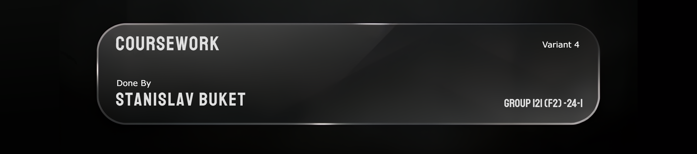
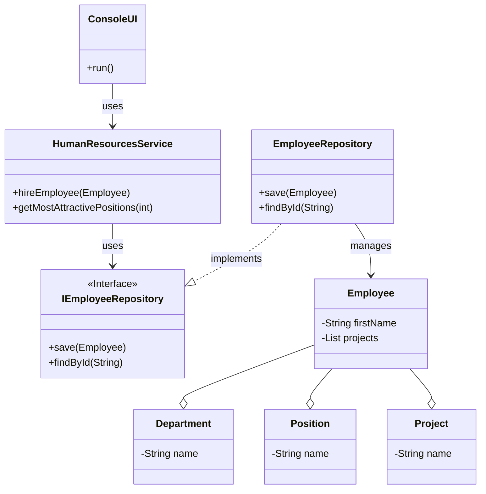

> Курсова робота
[Загальні вимоги](«Об’єктно-орієнтоване%20програмування»,%20завдання%20курсових%20робіт.%20Кафедра%20ІПЗ,%20НАУ,%202025%20-%20КР_Завдання.pdf) 
| [Варіанти](./КР_Варіанти.pdf)

## 📝 Задача
- Розробити консольний застосунок для відділу кадрів (Варіант №4).
- Реалізувати управління сутностями: Співробітник, Відділ, Посада, Проєкт (CRUD).
- Реалізувати бізнес-логіку для сортування, звітів та складних запитів.
- Забезпечити багатошарову архітектуру та збереження даних у JSON-файли.

## 🛠️ Структура проєкту
Проєкт реалізовано за багатошаровою архітектурою, де кожен шар винесено в окремий модуль:

- `domain`: Містить сутності (`Employee`, `Department` тощо) та інтерфейси репозиторіїв.
- `data-access`: Реалізація репозиторіїв, що відповідає за збереження та завантаження даних у JSON-файли.
- `app`: Містить бізнес-логіку (`HumanResourcesService`) та шар представлення (`ConsoleUI`).
- `coursework-tests`: Модульні тести для перевірки коректності бізнес-логіки.

## 🚀 Як запустити

> [!IMPORTANT]
> Для коректної роботи проєкту необхідно, щоб у системі був встановлений **JDK 11**.

1.  Перейдіть у кореневу директорію проєкту `KAI_OOP`.
2.  Виконайте наступну команду у вашому терміналі:

    ```bash
    # Для Windows
    gradlew.bat :coursework:run

    # Для Linux/macOS
    ./gradlew :coursework:run
    ```

## Mermaid UML Діаграма класів



## 🥹 Чек-лист вимог до курсової роботи

- [x] Консольний застосунок з командним рядком.
- [x] Багатошарова архітектура (мінімум 3 проєкти: PL, BLL, DAL).
- [x] Шар доступу до даних (DAL) реалізовано через серіалізацію в JSON.
- [x] Обов'язковий контроль коректності введених даних у шарі представлення.
- [x] Реалізовано обробку виняткових ситуацій (напр. `DuplicateEntityException`).
- [x] Написано модульні тести для бізнес-логіки (JUnit 5).
- [x] Покриття тестів: 100% для однієї сутності та >50% для решти.
- [x] Дотримання принципів ООП (IoC, loose coupling, composition over inheritance).
- [x] Код відповідає стилю "хорошого програмування" (без public полів, класи в окремих файлах).
