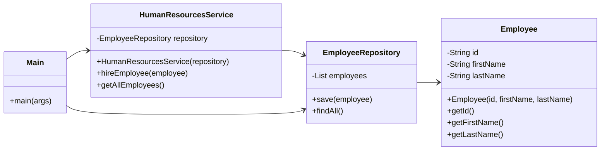

# Курсова робота - Відділ кадрів

## 📝 Завдання
Варіант 4: "Відділ кадрів: ведення особових справ робітників".

Цей проєкт є консольною програмою для управління записами співробітників відділу кадрів.

## 🛠️ Структура проєкту

- `domain`: Модуль з класами сутностей (наприклад, `Employee`).
- `data-access`: Модуль, що відповідає за збереження та доступ до даних (наприклад, `EmployeeRepository`).
- `app`: Головний модуль, що містить інтерфейс користувача та бізнес-логіку (`Main`, `HumanResourcesService`).

## 🚀 Як запустити

> [!IMPORTANT]
> Для коректної роботи проєкту необхідно, щоб у системі був встановлений **JDK 11**.

1.  Перейдіть у кореневу директорію проєкту `KAI_OOP`.
2.  Виконайте наступну команду у вашому терміналі:

    ```bash
    # Для Windows
    gradlew.bat :coursework:app:run

    # Для Linux/macOS
    ./gradlew :coursework:app:run
    ```

## Mermaid UML Діаграма класів

