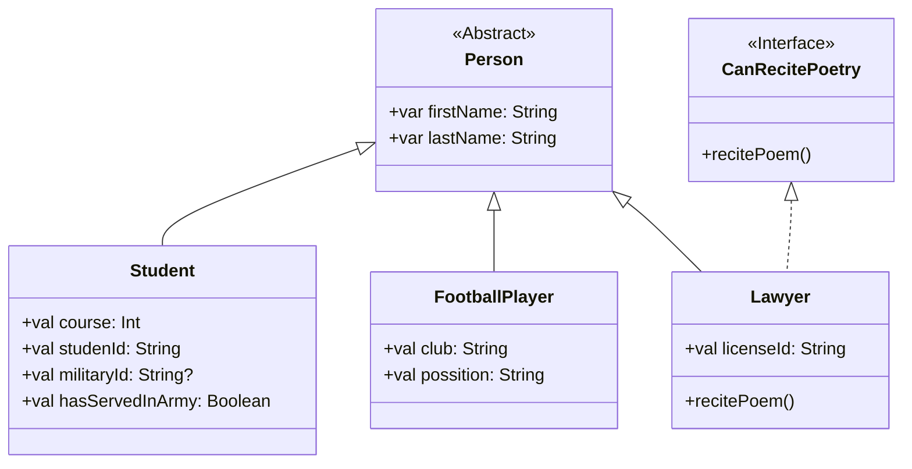

> Лабораторна #3.1
[pdf](./Лабораторна_робота_3.1.pdf)"

## 📝 Задача
 - Збереження та завантаження даних у текстовий файл спеціального формату.
 - Пошук студентів 5-го курсу, які проходили службу в армії.
 - Демонстрація поліморфізму через виклик унікальних навичок.

## 🛠️ Структура проєкту

- `domain`: Модуль з класами сутностей (`Person`, `Student` тощо).
- `data-access`: Модуль, що відповідає за роботу з файлами.
- `app`: Головний модуль із UI (`ConsoleUI`) та бізнес-логікою (`UniversityService`).

## 🚀 Як запустити

> [!IMPORTANT]
> Для коректної роботи проєкту необхідно, щоб у системі був встановлений **JDK 11**.

1.  Перейдіть у кореневу директорію проєкту `KAI_OOP`.
2.  Виконайте наступну команду у вашому терміналі:

    ```bash
    # Для Windows
    gradlew.bat :lab1:run

    # Для Linux/macOS
    ./gradlew :lab1:run
    ```

## Mermaid UML Діаграма класів



## 🥹 Чек-лист вимог для "Відмінно"

- [x] Винесення логіки роботи з файлами в окремий модуль (`data-access`).
- [x] Винесення логіки вводу-виводу на консоль в окремий клас (`ConsoleUI`).
- [x] Використання абстракцій (абстрактний клас `Person`, інтерфейс `CanRecitePoetry`).
- [x] Реалізація власного парсера для роботи з файлами (без сторонніх бібліотек як GSON).
- [x] Потокова обробка даних (без завантаження всіх об'єктів у колекцію в пам'яті).
- [x] Використання регулярних виразів для валідації даних (`studentId`, `militaryId`).
- [x] Інкапсуляція логіки збірки модулів лабораторної.
